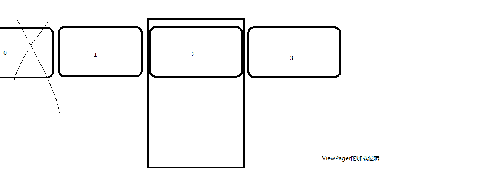

# Image Gallery App
[Android Glide Image Library – Building Image Gallery App](http://www.androidhive.info/2016/04/android-glide-image-library-building-image-gallery-app/)  


## 用到的知识点

- Glide
- Volley
- Json解析
- 自定义RecycleView Item的事件处理（为何要自定义，直接为ImageView设置属性`android:clickable="true"`，然后在利用现有接口是否可行？）
- GestureDetector手势识别
- 简单的自定义布局
- ViewPager
- DialogFragment全屏显示


ViewPager位于Fragment中，直接实现PagerAdapter而非使用现有的FragmentStatePagerAdapter，也就是说这里并没有使用ViewPager来切换Fragment，而只是用ViewPager来切换全屏显示的图片，并实时更改图片标题等信息。  


> 而《Android权威编程指南》中是
```
             fm                  fm
Activity  ---------> ViewPager ------->   Fragment  

fm指FragmentManager；在ViewPager中切换的是不同的Fragment
```


ViewPager的工作原理：

