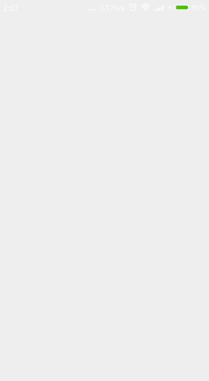

# Android Material Design Floating Labels for EditText
[Android Material Design Floating Labels for EditText](http://www.androidhive.info/2015/09/android-material-design-floating-labels-for-edittext/)

  

## 简介
掌握浮动标签的使用。此处示例在简单的表单验证时使用浮动标签。

浮动标签：在EditText上显示浮动标签。最初，当字段为空时，它将作为EditText中的提示。
当用户开始输入文字时，标签开始浮动。

本Demo功能并不完善。比如没有验证用户名是否包含特殊字符；没有验证密码的最小长度；没有让用户输入两次密码来确认密码。

## 知识点

- TextInputLayout:用来在EditText上显示浮动标签。EditText必须由TextInputLayout包裹才能显示浮动标签。
还可使用`setErrorEnabled()`和`setError()`为EditText设置错误消息。
- 验证表单数据（用户输入），比如使用系统自带正则工具校验email地址
- 为EditText设置，TextChange... 监听器。（已更改为监听焦点的改变）
- `android:drawableStart="@drawable/email"` 为EditText左边开始处添加一个图片

### View.requestFocus()

先更要让某个视图获得焦点，一种方法是用户使用物理方向键将焦点移动到该视图，另一种方法是程序员直接调用View.requestFocus()。
requestFocus()也是不能独自完成的，当一个视图想要获取焦点时，必须请求它的父视图来完成该操作。
因为父视图知道当前哪个视图正在拥有焦点，如果要进行焦点的切换，则必须要先告诉原先的视图放弃焦点，
而这些操作所需要的信息正是父视图中保存的，所以requestFocus()也必须由父视图来完成。

因为该函数内部实现上为在DOWN方向上找下一个可以获得焦点的视图，至于是哪一个视图就不一定了，这取决于父视图的执行逻辑，
这就是为什么该函数的返回值是一个boolean的原因，其意义是该视图到底能不能获得焦点。

> 学习了Android的样式和主题，见相关笔记。
