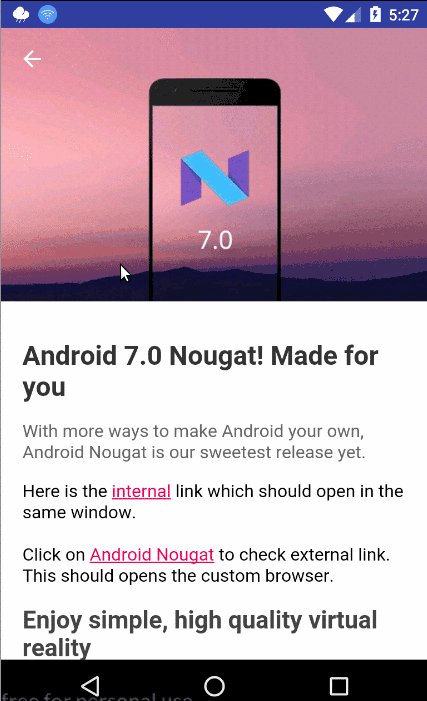

# android working with webview building a simple in app browser

[android-working-with-webview-building-a-simple-in-app-browser](http://www.androidhive.info/2016/12/android-working-with-webview-building-a-simple-in-app-browser/)  

## 用到的知识
- WebView的使用，和加载apk包中的html和css
- 进度条ProgressBar的完美搭配(必看)
- 与CardView模块一样对CoordinatorLayout、AppBarLayout、CollapsingToolbarLayout、Toolbar的使用
- (在Utils.java中)对Drawable的进一步了解，Drawable的共享
- 从url中解析域名
- Activity的invalidateOptionsMenu()方法

## Drawable相关
PorterDuffColorFilter 一个可以使用单个颜色和指定Porter-Duff模式来对源像素进行染色颜色过滤器。

Porter-Duff模式

说明文档,这个没啥好的中文翻译，我看到一句：Porter-Duff 操作是 1 组 12 项用于描述数字图像合成的基本手法。用人话讲就是：2张图要放在一张画板上，这两张图需要融合在一起，融合的方法有12个，他们统称Porter-Duff。具体的融合方法请仔细看下图，

  

[Android Drawable完全解析（一）：Drawable源码分析（中）](http://www.jianshu.com/p/2213c62e4738)  
[Drawable Mutations(Android Drawable 深入分析)](http://www.cnblogs.com/lbeing/archive/2011/06/13/2080168.html)  

## WebView
WebView可以自身使用，或结合其子类一起使用。

WebView常用子类：

- WebSetting类: 对WebView进行配置和管理
- WebVewClient类: 处理各种通知和请求事件
- WebChromeClient类: 辅助WebView处理JavaScript的对话框，网站图标、网站标题等

参考： [Android开发：最全面、最易懂的Webview使用详解](http://www.jianshu.com/p/3c94ae673e2a#)  

在我的小米2S的API21中，WebViewClient的shouldOverrideUrlLoading()方法并不会被触发

而在虚拟机的API24中，该方法会被触发。

可能是WebView的问题，或者...，可以考虑适配相应版本。

## Menu
系统会自动处理action bar上的Home/Up按钮点击事件。

Activity的invalidateOptionsMenu()方法，用于声明Menu已经发生改变，应该重新创建。

